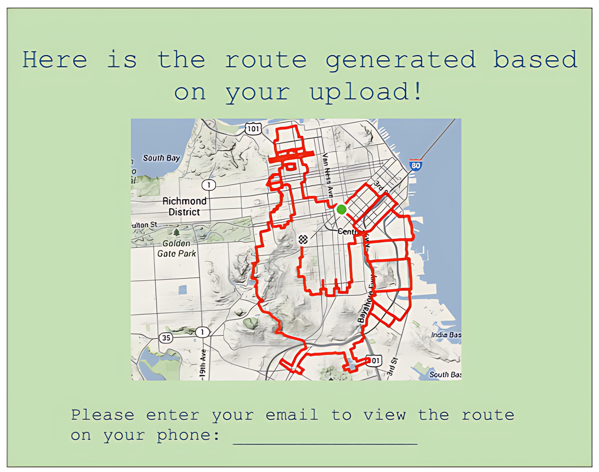
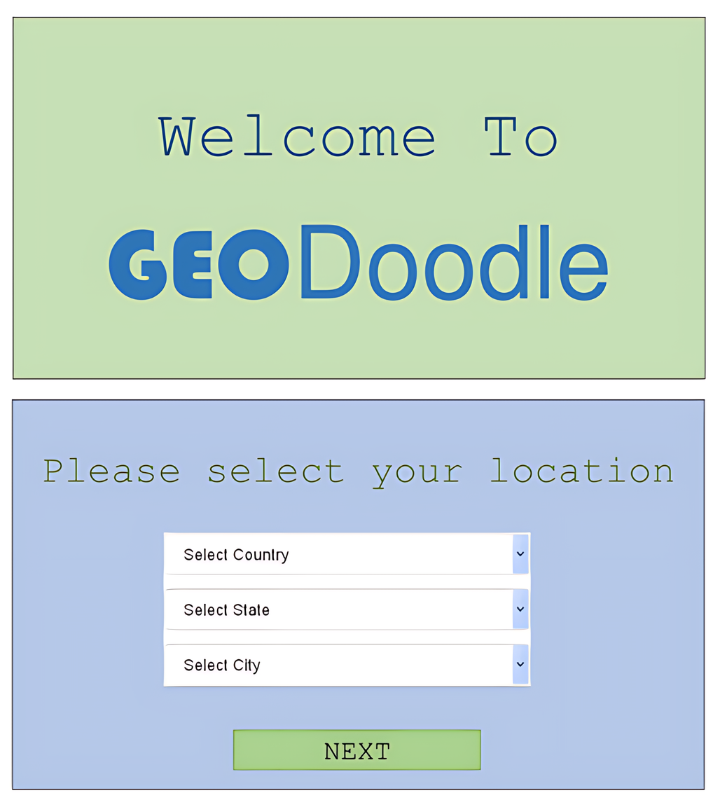
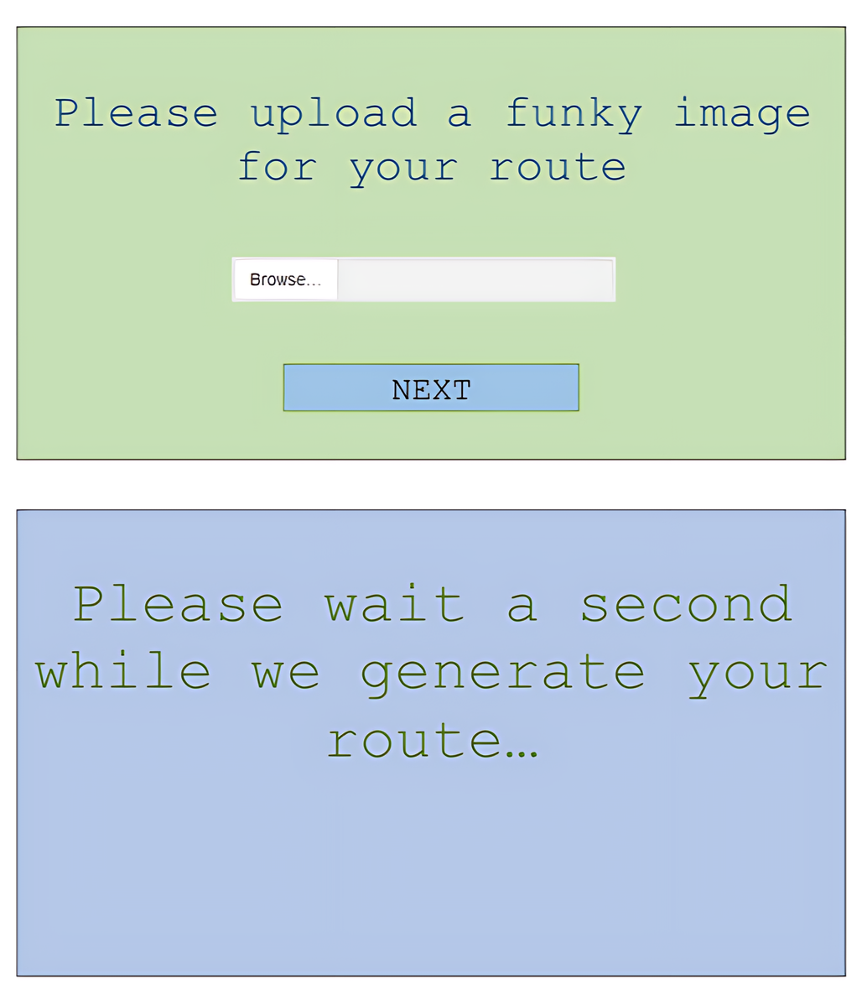

# Welcome to GeoDoodle!

GeoDoodle is an interactive application that allows users to create geographical doodles in the form of Google Maps running (walking) routes. Co-authored with Alina Kravenchko, Arsh Kochar, and Aaron Roitman.

<!--  -->

Generated Route             |  Home Page                |  Input Page
:-------------------------:|:-------------------------:|:-------------------------:
  |    |  

**Coordinate Conversion**: Users supply coordinates on a Cartesian plane, which are then converted to latitude and longitude values for accurate placement on the map.

## Current State

Please note that the current state of the repository is only for Windows.

## Requirements

To run GeoDoodle, ensure you have the following:

- **QtCreator**: Open the `.pro` file in QtCreator and hit the big green button in the bottom left to run the application.
- **OpenSSL**: Required for secure network communication. You can download third-party binaries from [OpenSSL Binaries](https://wiki.openssl.org/index.php/Binaries).
- **Qt Version**: Your Qt installation must include the Web Engine and Network libraries.
- **Compiler**: The project must be compiled with MSVC 2017 or later. Some machines may require the 32-bit version.

## Installation

1. **Clone the Repository**: `git clone https://github.com/yourusername/geodoodle.git`
2. **Open in QtCreator**: Navigate to the project directory and open the `.pro` file in QtCreator.
3. **Install Dependencies**: Ensure OpenSSL and the required Qt libraries are installed.
4. **Compile and Run**: Hit the big green button in the bottom left of QtCreator to compile and run the application.

## APIs and Libraries Used

- **Qt Web Engine**: For rendering and interacting with web content.
- **Qt Network**: For handling network operations and communication.
- **OpenSSL**: For secure network communication.
- **Google Maps API**: For map rendering and geographical data.

Enjoy doodling!